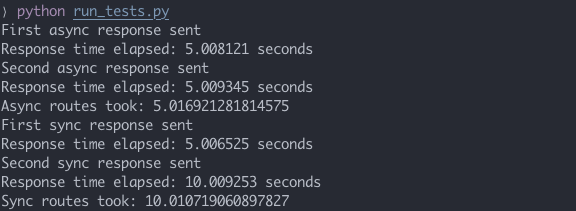

# Starlette Framework Tutorial

This is the code written based on Zachary Bennett's [Building Async Python Services with Starlette Tutorial.](https://www.pluralsight.com/guides/building-async-python-services-with-starlette)

**Python version: 3.8.5**

**Starlette version: 0.14.1**

---

This [starlette](https://www.starlette.io) server offers two async routes with a 5s delay, and two sync routes with a 5s delay. 

The test script uses [requests-futures](https://github.com/ross/requests-futures) to make two async requests together, then two sync requests together. The non-blocking feature of the starlette server is evident in the time differences identified by the test script.



## Set up

Create a virtual environment and activate it:

```bash
python3 -m venv venv
source venv/bin/activate
```

Install the requirements:

```bash
pip install -r requirements.txt
```

## Run

Run the server:

```bash
source venv/bin/activate
python run_server.py
```

**While the server is running,** run the tests:

```bash
source venv/bin/activate
python run_tests.py
```
